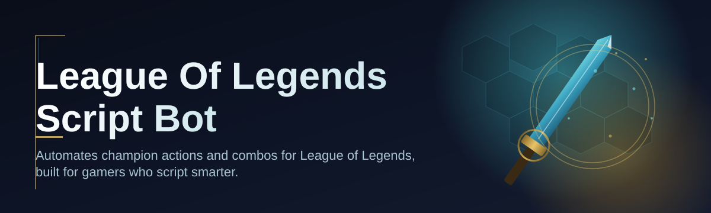

# lol-script-companion

Automates champion actions and combos for League of Legends, built for gamers who script smarter.

  

## Overview

Automates champion actions and combos for League of Legends, built for gamers who script smarter.

## License

[MIT License](LICENSE)
